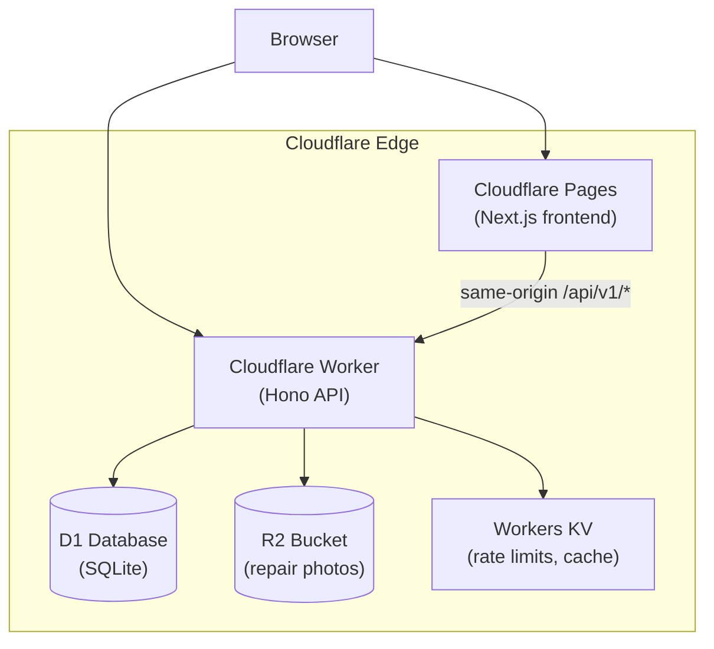
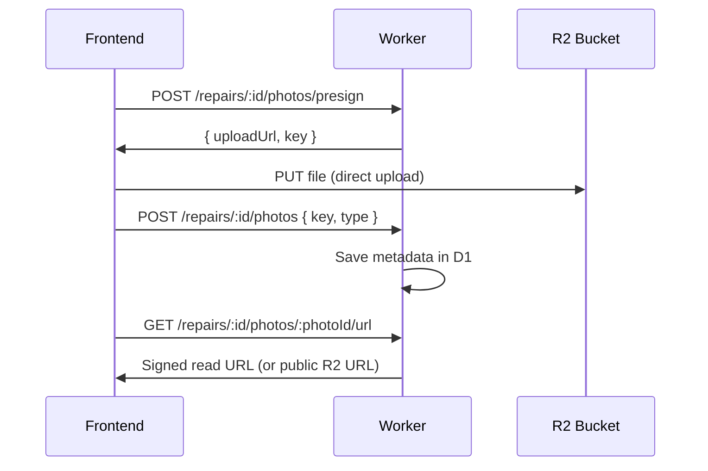
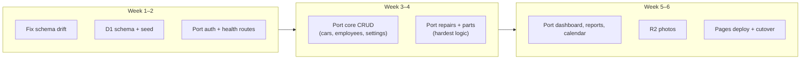

# SAGMAN → Cloudflare Migration Plan

Sagman is a **pnpm monorepo** with a **Fastify + PostgreSQL + Prisma** API and a **Next.js 15** frontend, deployed today via **Docker + Nginx**. Moving to Cloudflare means replacing the self-hosted Node server with **managed Workers**, PostgreSQL with **D1**, and local uploads with **R2**. You still need an API layer — it just runs on Cloudflare Workers instead of a VPS.

---

## Target Architecture



| Component | Today | Target |
|-----------|-------|--------|
| Frontend | Next.js in Docker | **Cloudflare Pages** via `@opennextjs/cloudflare` |
| API | Fastify on Node :4000 | **Cloudflare Worker** (Hono) |
| Database | PostgreSQL 16 + Prisma | **D1** (SQLite) + Drizzle ORM |
| File storage | Local `./uploads` (not wired) | **R2** with presigned uploads |
| Auth | JWT via `@fastify/jwt` | **`jose`** (already in web app) |
| Rate limiting | `@fastify/rate-limit` | **Cloudflare WAF rules** + optional KV counters |
| Redis | Docker (unused) | Drop — not needed for v1 |

---

## What Cannot Move As-Is

These block a lift-and-shift deploy:

| Item | Why it breaks | Fix |
|------|---------------|-----|
| **Fastify server** | Workers use Fetch handlers, not Node HTTP | Rewrite as Hono Worker |
| **Prisma + PostgreSQL** | No TCP on Workers; PG enums/types differ | Migrate schema to D1 + Drizzle |
| **`prisma.$executeRaw` invoice counter** | PG-specific SQL | D1 `batch()` transaction |
| **`next.config.ts` rewrites → localhost:4000** | Dev-only proxy | Route `/api/v1/*` to Worker |
| **Docker / Nginx / volumes** | Not used on Cloudflare | Remove from deploy path |
| **`@fastify/static` + local FS** | No persistent disk | R2 |
| **Schema drift** (`Client` model removed but routes still use `prisma.client`) | Runtime failures | Fix before migration |

---

## Recommended Monorepo Restructure

```
SAGMAN/
├── apps/
│   ├── web/              # Next.js → Cloudflare Pages (keep, adapt)
│   └── worker/           # NEW — Hono API (replaces apps/api/)
├── packages/
│   ├── db/               # Drizzle schema + D1 migrations (replaces Prisma)
│   ├── shared/           # Keep — Zod schemas are runtime-agnostic
│   └── config/
├── wrangler.toml         # Worker + D1 + R2 bindings
└── open-next.config.ts   # Pages build config
```

Keep `apps/api/` during migration for reference; delete once the Worker is feature-complete.

---

## Phase 0 — Pre-Migration Fixes (1–2 days)

Do this on the current stack before touching Cloudflare.

1. **Fix schema drift**
   - Portal routes call `prisma.client`, but the schema uses `User` for clients.
   - Decide: restore a `Client` model, or finish the `User`-as-client migration everywhere (portal, search, appointments).
   - This must be consistent in the D1 schema.

2. **Implement or defer photo uploads**
   - `RepairPhoto` exists; upload routes do not.
   - On Cloudflare, implement uploads in R2 from the start — skip local FS entirely.

3. **Remove dead code**
   - Unused Redis references, OTP routes in nginx/docs, `@fastify/multipart` if not used.

---

## Phase 1 — Database: PostgreSQL → D1 (3–5 days)

### Why Drizzle over Prisma on D1

Prisma has a D1 adapter, but **Drizzle** is the better fit for Workers: smaller bundle, native D1 support, SQL you control. Your Zod schemas in `@sagman/shared` stay the validation layer.

### Schema conversion checklist

| PostgreSQL (Prisma) | D1 (SQLite) |
|---------------------|-------------|
| `enum Role` | `TEXT` + CHECK or app-level enum |
| `@default(cuid())` | `TEXT PRIMARY KEY` + app-generated CUID/nanoid |
| `TIMESTAMP(3)` | `TEXT` (ISO 8601) or `INTEGER` unix ms |
| `Json` diagnosis fields | `TEXT` (JSON.stringify) |
| `Decimal` amounts | `INTEGER` (cents) or `REAL` |
| Soft deletes (`deleted_at`) | Same pattern |
| FK constraints | Same in SQLite |

### Tables to migrate (17 models)

`users`, `cars`, `appointments`, `repair_jobs`, `repair_mechanics`, `repair_status_logs`, `repair_work_logs`, `delay_reports`, `parts`, `stock_transactions`, `repair_parts`, `labor_items`, `payments`, `repair_photos`, `notification_logs`, `system_settings`, `invoice_counters`

### Invoice counter (atomic increment on D1)

Replace the raw PostgreSQL UPDATE with a D1 batch transaction:

```typescript
// packages/db/src/invoice.ts
export async function generateInvoiceNumber(db: D1Database): Promise<string> {
  const year = new Date().getFullYear();
  await db.batch([
    db.prepare(`INSERT INTO invoice_counters (year, last_seq) VALUES (?, 0) ON CONFLICT(year) DO NOTHING`).bind(year),
    db.prepare(`UPDATE invoice_counters SET last_seq = last_seq + 1 WHERE year = ?`).bind(year),
  ]);
  const { last_seq } = await db.prepare(`SELECT last_seq FROM invoice_counters WHERE year = ?`).bind(year).first<{ last_seq: number }>();
  return `INV-${year}-${String(last_seq).padStart(5, '0')}`;
}
```

### Data migration (if you have production data)

1. Export PG → JSON/CSV (`pg_dump` or Prisma script).
2. Transform enums, timestamps, decimals.
3. Import via `wrangler d1 execute` or a one-time seed script.

For a greenfield deploy, use a D1 seed script (same as current `packages/db/src/seed.ts`).

---

## Phase 2 — API: Fastify → Cloudflare Worker (2–3 weeks)

This is the largest effort: **~80 endpoints** across auth, employees, cars, appointments, repairs, parts, payments, portal, dashboard, reports, calendar, search.

### Framework: Hono

Hono is lightweight, TypeScript-first, and built for Workers. Structure mirrors your current routes:

```
apps/worker/src/
├── index.ts              # Hono app + route mounting
├── middleware/
│   ├── auth.ts           # JWT verify (jose)
│   ├── authorize.ts      # Role checks
│   └── rate-limit.ts     # Optional KV-based
├── routes/v1/            # Mirror apps/api/src/routes/v1/*
├── services/             # Port repair, invoice, whatsapp services
└── bindings.ts           # D1, R2, KV types
```

### Auth port

| Fastify | Worker |
|---------|--------|
| `@fastify/jwt` sign/verify | `jose` `SignJWT` / `jwtVerify` |
| `@fastify/cookie` | `Set-Cookie` headers manually |
| `bcryptjs` hash/compare | Keep `bcryptjs` (pure JS; watch CPU limits) or migrate to `@noble/hashes/scrypt` |

JWT payload shape stays the same (`type: "access" | "refresh" | "client"`, `role`, `sub`).

### Business logic to port verbatim

These are mostly database calls and can move with minimal changes:

- `repair.service.ts` — state machine, overdue logic
- `invoice.service.ts` — adapted for D1 batch
- `whatsapp.service.ts` — pure string builders, no changes

### Rate limiting

| Route | Today | Cloudflare |
|-------|-------|------------|
| `/auth/login` | 5/15min | WAF rate limit rule or KV counter |
| `/auth/register` | 3/hr | Same |
| Global | 300/min | Cloudflare dashboard rule |

You can drop `@fastify/rate-limit` and use Cloudflare’s built-in protection.

---

## Phase 3 — R2 File Storage (2–3 days)

Photos are not implemented yet — implement them correctly for R2 from the start.

### Flow



### Schema (`repair_photos`)

```sql
-- file_path becomes r2_key
r2_key TEXT NOT NULL,
mime_type TEXT,
size_bytes INTEGER,
```

### `wrangler.toml` binding

```toml
[[r2_buckets]]
binding = "UPLOADS"
bucket_name = "sagman-uploads"
```

---

## Phase 4 — Frontend: Cloudflare Pages (3–5 days)

### Build adapter

Use **`@opennextjs/cloudflare`** (successor to `@cloudflare/next-on-pages`):

```bash
pnpm add -D @opennextjs/cloudflare wrangler --filter @sagman/web
```

Add `open-next.config.ts` and update build scripts:

```json
{
  "build": "opennextjs-cloudflare build",
  "preview": "opennextjs-cloudflare preview",
  "deploy": "opennextjs-cloudflare deploy"
}
```

### API routing options

**Option A — Same domain (recommended)**

Cloudflare route: `yourdomain.com/api/v1/*` → Worker  
Pages serves everything else. No CORS, minimal frontend changes.

**Option B — Subdomain**

`api.yourdomain.com` → Worker  
Update `api-client.ts`:

```typescript
const API_BASE = process.env.NEXT_PUBLIC_API_URL ?? "/api/v1";
```

### Frontend changes

| File | Change |
|------|--------|
| `next.config.ts` | Remove dev rewrite (or keep for local-only) |
| `src/lib/api-client.ts` | Use env-based API base URL |
| `src/middleware.ts` | Verify JWT with `jose` + `JWT_SECRET` binding (optional hardening) |
| `images.domains` | Add R2 public domain or custom domain |

### Compatibility checks

| Feature | Status on Pages |
|---------|-----------------|
| next-intl | Supported via OpenNext |
| Edge middleware | Supported |
| recharts | Client-only — add `"use client"` where needed |
| localStorage auth | Works (browser-only) |
| Google Fonts | Works |

---

## Phase 5 — Wrangler & Deployment Config (1 day)

### Root `wrangler.toml`

```toml
name = "sagman-api"
main = "apps/worker/src/index.ts"
compatibility_date = "2024-11-01"
compatibility_flags = ["nodejs_compat"]

[[d1_databases]]
binding = "DB"
database_name = "sagman"
database_id = "<your-id>"

[[r2_buckets]]
binding = "UPLOADS"
bucket_name = "sagman-uploads"

[[kv_namespaces]]
binding = "KV"
id = "<your-id>"

[vars]
JWT_ACCESS_EXPIRES_IN = "8h"
JWT_REFRESH_EXPIRES_IN = "30d"

# Secrets (set via wrangler secret put):
# JWT_SECRET
```

### Environment variables

| Variable | Where | Notes |
|----------|-------|-------|
| `JWT_SECRET` | Worker secret | Same as today |
| `NEXT_PUBLIC_API_URL` | Pages env | `/api/v1` or full URL |
| `DATABASE_URL` | **Remove** | Replaced by D1 binding |
| `UPLOAD_DIR` | **Remove** | Replaced by R2 |
| `REDIS_URL` | **Remove** | Unused |
| `POSTGRES_*` | **Remove** | No PostgreSQL |

### Deploy commands

```bash
# D1 migrations
wrangler d1 migrations apply sagman --local   # dev
wrangler d1 migrations apply sagman           # prod

# API Worker
wrangler deploy

# Frontend
cd apps/web && pnpm deploy
```

### CI/CD (GitHub Actions)

```yaml
# Suggested pipeline
- pnpm install
- pnpm typecheck
- wrangler d1 migrations apply sagman
- wrangler deploy                    # API
- pnpm --filter @sagman/web deploy   # Pages
```

---

## Phase 6 — Testing & Cutover (3–5 days)

### Test matrix

| Area | Tests |
|------|-------|
| Auth | Employee login, portal login, refresh, logout |
| Repairs | Full state machine (received → delivered) |
| Stock | Part assign decrements stock atomically |
| Payments | Invoice number uniqueness under concurrency |
| Portal | Client sees only own cars/repairs |
| Photos | Presign → upload → read URL |
| Dashboard | Aggregations match expected KPIs |

### Local dev workflow

```bash
# Terminal 1: D1 local + Worker
wrangler dev --local

# Terminal 2: Next.js (points to local Worker)
NEXT_PUBLIC_API_URL=http://localhost:8787/api/v1 pnpm dev:web
```

---

## Effort Estimate

| Phase | Effort | Priority |
|-------|--------|----------|
| 0 — Fix schema drift | 1–2 days | **Blocker** |
| 1 — D1 + Drizzle schema | 3–5 days | **Blocker** |
| 2 — Worker API port | 2–3 weeks | **Blocker** |
| 3 — R2 uploads | 2–3 days | Medium |
| 4 — Pages frontend | 3–5 days | **Blocker** |
| 5 — Wrangler/deploy | 1 day | Required |
| 6 — Testing | 3–5 days | Required |
| **Total** | **~4–6 weeks** | |

---

## Migration Strategy: Incremental vs Big Bang

### Recommended: Strangler pattern



Port routes in this order:

1. `/health`, `/auth/*` — unblock login
2. `/settings/public`, `/cars`, `/employees` — basic CRUD
3. `/repairs/*`, `/parts/*` — core business logic
4. `/payments/*`, `/portal/*` — client-facing
5. `/dashboard/*`, `/reports/*`, `/calendar/*`, `/search` — analytics last

---

## What You Can Remove After Migration

- `docker-compose.yml`, `docker-compose.prod.yml`
- `docker/nginx/`, `apps/api/Dockerfile`, `apps/web/Dockerfile`
- `apps/api/` (entire Fastify app)
- Prisma PostgreSQL config
- Redis container and env vars
- Nginx SSL management

---

## Risks & Mitigations

| Risk                                 | Impact                | Mitigation                                 |
| ------------------------------------ | --------------------- | ------------------------------------------ |
| D1 write limits (1000/day free tier) | Low for single garage | Paid plan; batch writes                    |
| Worker CPU time on bcrypt            | Slow logins           | Lower bcrypt rounds; consider scrypt       |
| Drizzle rewrite of 80 endpoints      | Large effort          | Port services first, routes second         |
| Next.js 15 + OpenNext edge cases     | Build failures        | Pin adapter version; test middleware early |
| No long-running connections          | N/A for this app      | Stateless JWT is already correct           |
| SQLite vs PG query differences       | Subtle bugs           | Integration tests on D1 local              |

---

## Alternative: Keep PostgreSQL via Hyperdrive

If D1 migration feels too heavy, you could:

- Keep **Neon PostgreSQL** (free tier)
- Connect via **Cloudflare Hyperdrive**
- Still use Workers + Pages + R2
- Keep Prisma with minimal schema changes

That avoids the PG→SQLite rewrite but adds an external DB dependency and monthly cost. Since you asked specifically for Cloudflare’s database, **D1 is the right choice** — just plan for the schema/ORM migration.

---

## Recommended First Steps

1. Fix the **Client/User schema drift** in the current codebase.
2. Create `apps/worker/` with Hono + `/health` + `/auth/login`.
3. Define the **D1 schema in Drizzle** and seed it.
4. Add **`wrangler.toml`** with D1 + R2 bindings.
5. Port one full vertical slice: **login → list cars → create repair** to validate the stack.
6. Set up **OpenNext** on Pages once auth works against the Worker.

---
